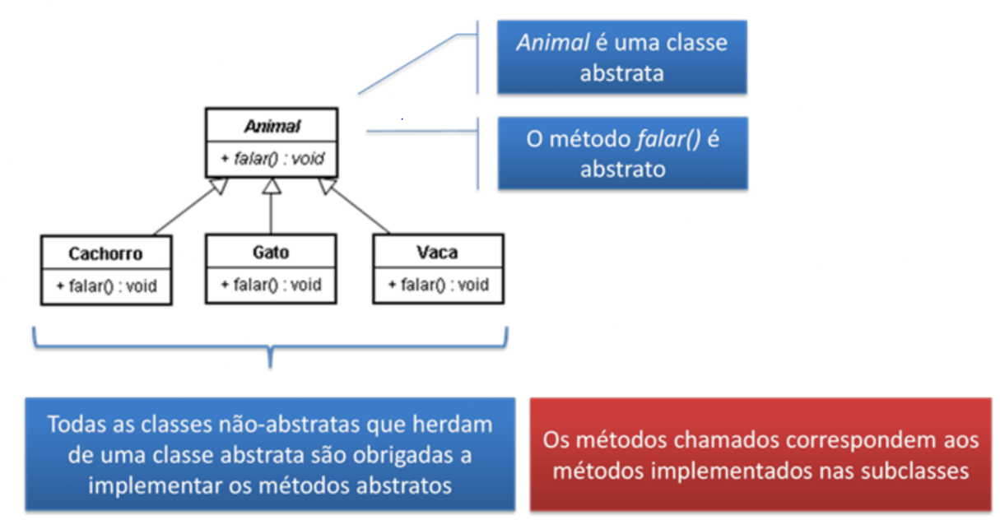
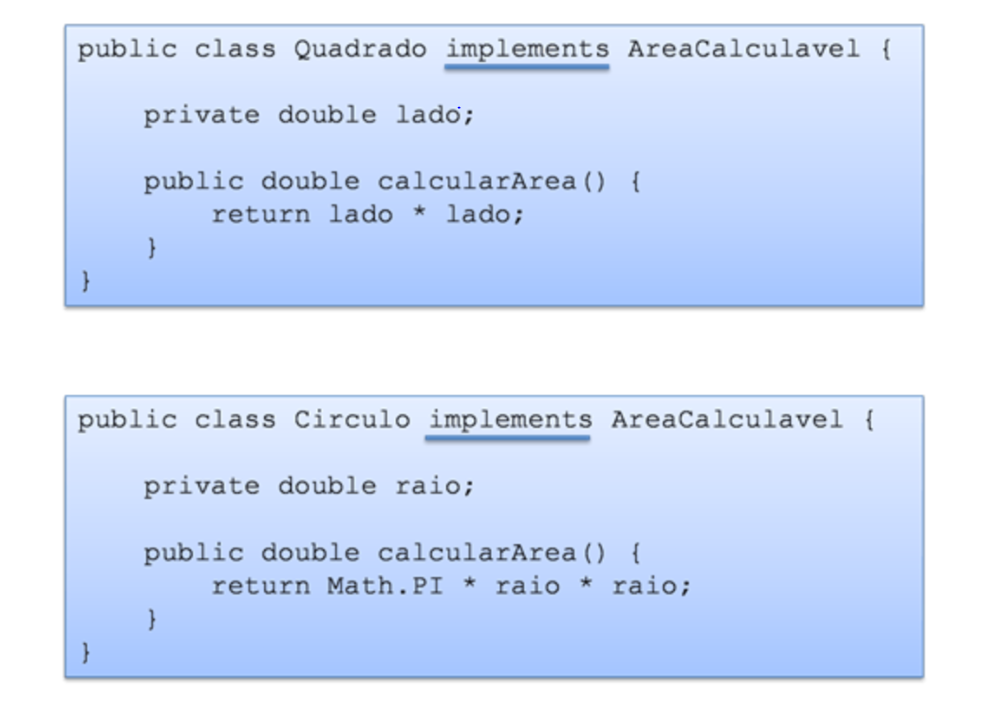
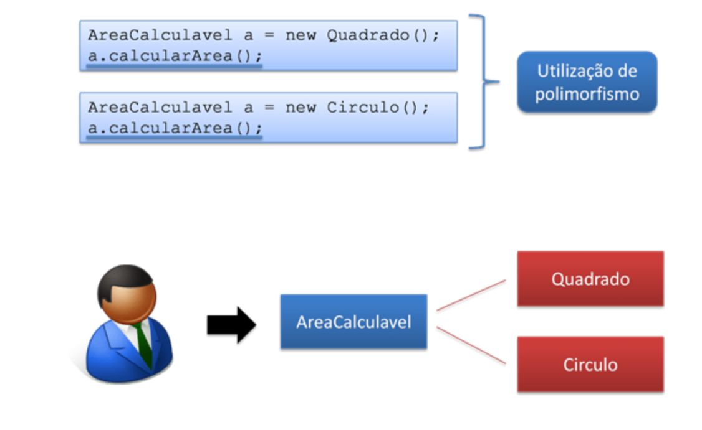

# Teoria: Classes Abstratas e Interfaces:

* Classe abstratas
  - Métodos abstratos
* Interfaces
  * Declarando interfaces
  * Implementando interfaces
  * Médotos default
  * Métodos estáticos
  * Métodos static
  * Métodos private
## Classes:
### Classes Abstratas X Interfaces
* Usadas quando não faz sentido termos instâncias de determinadas classe
* Mater a consistência do programa
* Utilizar o modificador abstract na declaração da classe

`Não é permitida a existência de objetos da classe se ela for abstrata`

Ex: Este código não compila;
```
  Animal a = new Animal(); 
```

`No entanto é permitido criar referências à classe`

Ex: A instância é do tipo Cachorro, portanto, esse código irá rodar;
```
Animal a = new Cachorro();
```
### Métodos Abstratos
* Utilizados quando não faz sentido termos a implementação do método em determinada clase
* Para declarar um método abstrato, basta utilizar o modificador abstract na declaração do método.


`Métodos abstratos não implementados, o método simplesmente terminar com ponto e vírgula `

#### Quem implementa?

```
  public abstract class Animal(){
    public abstract void falar();
  }   
```

* Classes abstratas não precisam obrigatoriamente ter métodos abstratos

* Métodos abstratos só podem existir em classes abstratas

## Interfaces: 
* Interface define métodos, não não os implementa.
  * Com exceção de métodos que usam os modificadores default, static e private
* A implementação é de responsabilidade de quem implementa a interface

1. O foco é no que o objeto faz, e não em como ele faz
2. Interfaces possibilitam mudanças de implementação muito mais facilmente, pois quem chama o método não conhece a sua implementação

Ex: Criando Interface
```
  public interface AreaCalculavel {
    public double calcularArea();
  } 
```
``A única coisa que a interface pode ter são constantes``

####Implmentando interfaces:




* Interfaces podem estender de outras interfaces
* Classes podem estender outra classe, mas apenas podem implementar interfaces
* Uma classe pode implementar uma ou mais interfaces

A formar como a implentação é feita não afeta o código que faz a chamada, porque este código enxerga apenas a interface;

## Métodos Default


