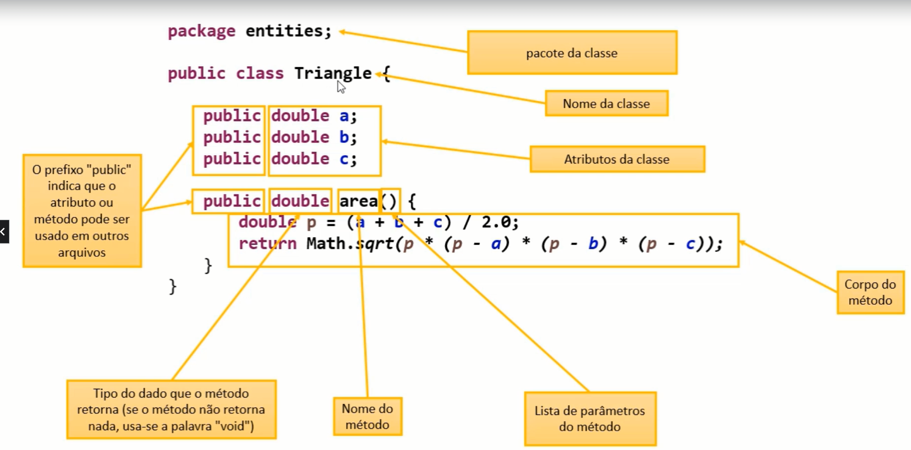

#Orientação a Objetos
###Problema exemplo:
Ex: 1
Fazer um programa para ler as medidas dos lados de dois triângulos X e Y (suponha medidas
válidas). Em seguida, mostrar o valor das áreas dos dois triângulos e dizer qual dos dois triângulos
possui a maior área.
A fórmula para calcular a área de um triângulo a partir das medidas de seus lados a, b e c é a
seguinte (fórmula de Heron);


```
        area = Math.sqrt(p * (p - a)(p - b)(p - c)) 
Onde: 
        p = (a + b + c)/ 2
```


### Projeto da classe (UML)
| Triangle          | _**Nome da classe**_      |
|-------------------|---------------------------|
| - A : double      | 
| - B : double      | _**Atributos da classe**_ | 
| - C : double      |
| + Area() : double | _**Métodos da classe**_   | 

##**_Discussão_** 
Quais são os benefícios de se calcular a área de um triângulo por meio de um Método
dentro da classe Triangle?

1) **Reaproveitamento de código :** _nós eliminamos o código repetido(cálculo das áreas dos triângulos x e y) no programa principal._
2) **Delegação de responsabilidades :** _quem deve ser responsável por saber como calcular a área de um triângulo é o próprio triângulo. A lógica do cálculo da área não deve estar em outro lugar._ 


##Classe

* É um tipo estruturado que pode conter(membros):
    * Atributos(dados/campos)
    * Métodos(funções /operações)

* A Classe também pode prover muitos outros recursos, tais como:
    * Construtores
    * Sobrecarga
    * Encapsulamente
    * Herança
    * Polimorfismo

* Exemplos:
    * Entidades: Produto,Cliente, Triangulo
    * Serviços: ProdutoService, ClienteService, ClienteController
    * Controladores: ProdutoController, ClienteController
    * Utilitários: Calculadora, Compactador
    * Outros(views, repositórios, gerenciadores, etc.)

 
